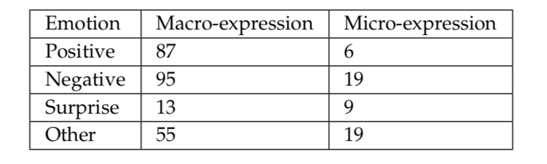
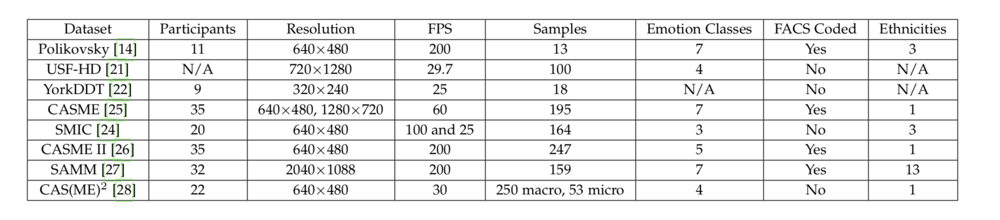
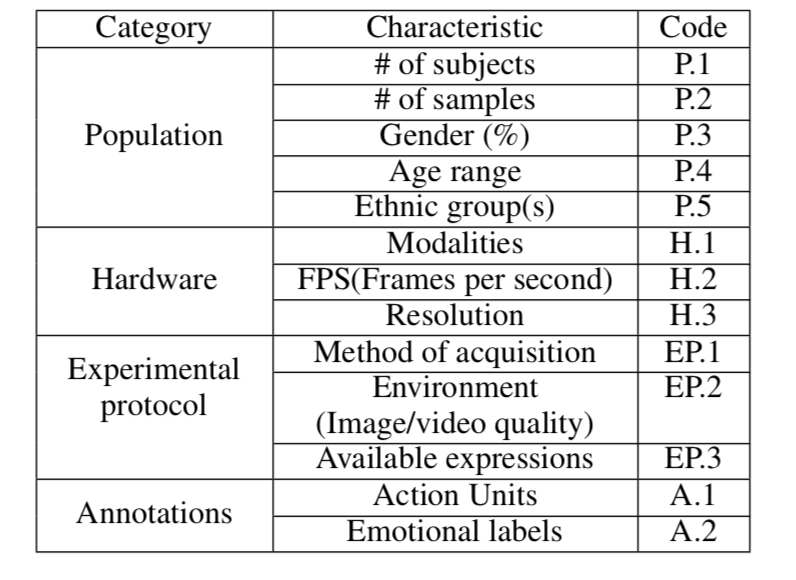
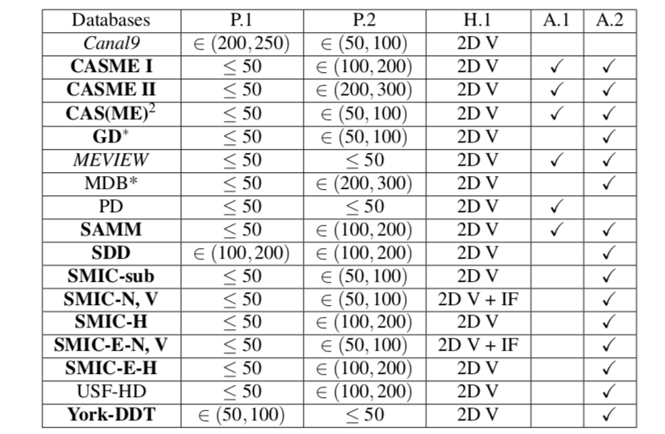
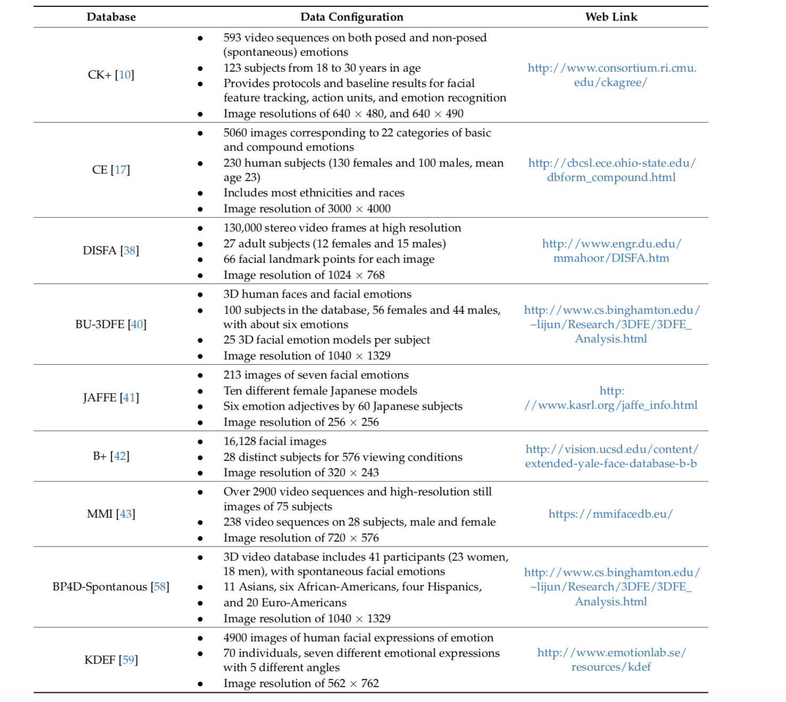
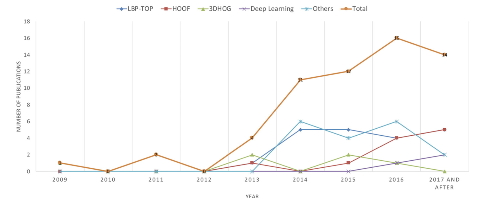
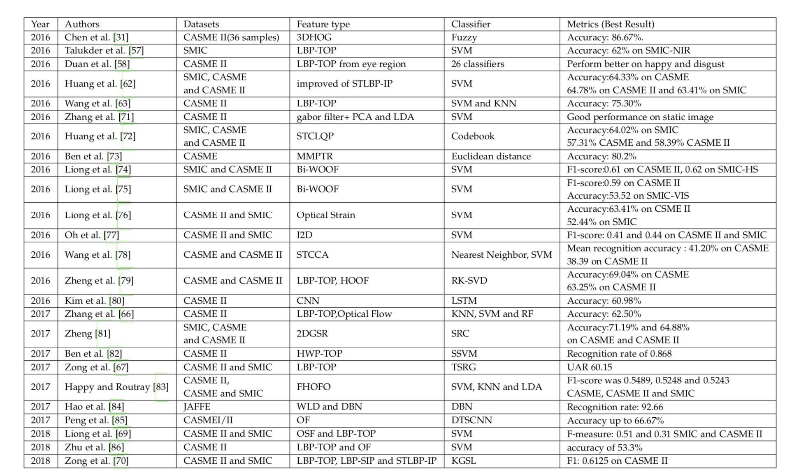
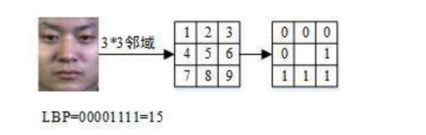
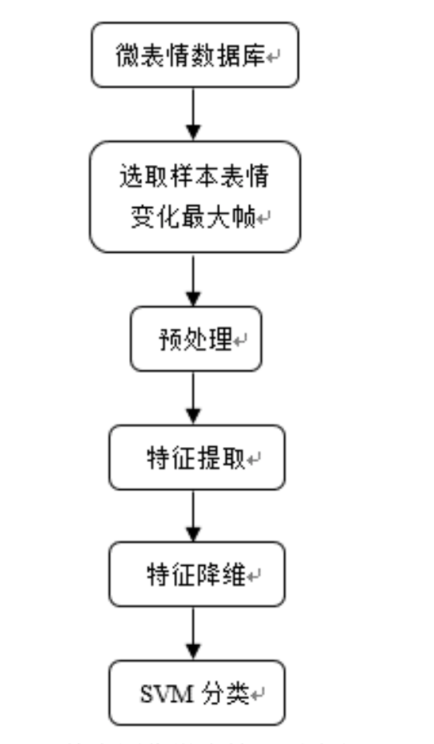

## 数据集

###CASME

2013

- 35个subject（22 male，13 female）

- 195段微表情序列
- 分辨率640*480
- 图像序列次啊用AUs编码，包括oneset、apex、offset三部分

### CASME2

- 分辨率640*480，人脸部分更高
- 26个subject
- 255个微表情序列（7类：高兴、厌恶、惊讶、抑郁、其他、害怕、悲伤）
- 样本数量分布不均匀

### SMIC

2012

- 由HS、VIS和NIR三部分组成

- HS

  16个subject（10 male 4 female），164个微表情序列，分辨率640*480

- VIS and NIR

  71个微表情序列，分辨率640*480

- 数据集氛围positive(happy)、negative（悲伤、愤怒、恐惧、厌恶）、surprise

- 观看影片、抑制情绪、控制面部表情、作出微表情后需口头陈述自己的心里感受，由心理研究院对微表情进行标记

### SAMM

- 第一个高分辨率的159个自发微动作数据集，是人口统计学中变异能力最大的微动作数据集
- 刺激针对subject量身定制，从而增加情绪唤起的机会。
- 该数据集中共报告了159个facs编码的微动作。

###(CAS(ME)^2）

- 包含了从600多个面部动作中分别选取的250个宏表情和53个微表情

- 已经被标记为结合了AUs，自我报告和情感类别决定的情感唤起视频。

- 包含四种情绪类别:积极、消极、惊讶等

  

### Poliskovsky

2009

- 图像分辨率为480*640

- 包括10个subjects（5个亚洲人、四个高加索人、一个印度人）

- 每个subject表现出面部变化很小的7种表情——要求面部肌肉运动强度尽可能低并且见快回到中性表情

###USF-HD

2009

- 47段视频序列组成，平均时长1min，181个普通表情（高兴、惊讶、愤怒、悲伤四类）、100个微表情
- 图像分辨率达到720*1280
- subjects被要求表现夸张的普通表情and 微表情

### comparison

- CASME II从高数量的参与者(35名参与者)中收集到的微表达样本数量较多，其与CASME相似，但有195个样本。
- 在CASME和CASME II中，所有参与者都是中国人，没有种族分布。SMIC有来自3个不同民族的参与者，而SAMM有13个不同民族参与者。
- SAMM在年龄分布上也有优势，平均年龄为33.24岁(SD:±11.32)。
- CASME II和SAMM具有较高的帧速率(200帧每秒)。SAMM是第一个高分辨率的数据集，设置为2040×1088像素，面部面积为400×400。
- CAS(ME)2的微表达样本数量有限，仅收集了53个。
- 在参与者的情绪刺激方面，CASME和SAMM分为7类，CASME II分为5类，SMIC只有3类。
- CASME、CASME II和SAMM都是使用FACS编码的。
- 虽然SAMM是由7个情绪类刺激的，但是在他们第一次发布的微动作的最终标签中只有FACS代码，而没有情绪类。
- CASME II和SAMM由于具备了识别微表情所需的所有标准而成为研究人员的焦点:情感类、高帧率、丰富的微表情以及面部运动强度的不同。

CASME I、CASME II和SAMM都有情感标签和AU标签。SMIC提供了一种多模态分析ME的可能性。SAMM满足了多民族。此外，SAMM和CAS(ME)2不仅有ME，还有其他面部动作。而且这两个数据库的视频长度都比其他数据库长。因此，尽管CASME II和SMIC是两种最常用的数据库，但是SAMM和CAS(ME)2对于提高现实世界中的ME分析性能是非常有希望的

这个是表情

## features

值得注意的是，3DHOG在早期的作品中使用过，但近年来没有HOOF那么受欢迎。LBP-TOP在2014年开始流行，并一直保持到今天。另一方面，深度学习仍处于起步阶段，但我们预计这一数字在未来将迅速增长。

### LBP_TOP

##### LBP的计算

将周围的8个数与中间的数进行比较，小于则取0，大于则取1，最后按一定的顺序组成一个二进制数，得到一个十进制数

##### LBP_TOP算子

在三个正交平面计算LBP值，然后将每个平面上的LBP值串联起来

### HOOF

### 深度学习

- 用CNN编码不同时间状态(起始、顶点和偏移)的空间信息的微表达式。该方法利用提取的特征，试图在将模型传递到长短时记忆(LSTM)递归神经网络时，帮助识别微表达类，并分析数据的瞬态特征。与目前最先进的微表情识别系统相比，总体实现的准确率为60.98%，与许多只使用准确率作为评价指标的微表情识别系统相比，还是比较接近的。数据集为CASME II（80）
- 双时间尺度卷积神经网络(DTSCNN)。由于现有数据集的数据不足，他们设计了一个较浅的神经网络用于微表情识别，卷积层和池化层都只有4层DTSCNN是一个双流网络。实验中使用CASMEI/II数据集，并由作者从两个数据集中选取数据进行合并，CASMEI/II被分为4类:Negative、Others、Positive和Surprise。其准确率最高为66.67%（85）
- 3DCNN

### others

- 基于delaunay的时间编码模型(DTCM)用于微表情识别。主动外貌模型(AAM)用于定义面部特征点(68个点)。基于特征点对德劳内三角剖分进行了简单的处理。RF和SVM被用作分类器。该方法在SMIC、CASME B类和CASME II上进行了评价。在SMIC、CASME B级和CASME II级测试中，分别获得了82.86%、64.95%和64.19%的成绩，优于目前的水平。（37）

## 当前进展

基于静态图像的微表情识别——选出数据库中每一个样本的表情变化最大帧当作该样本的静态微表情，提取局部二值模式和局部相位量化特征

基于动态序列的微表情识别——正交三维局部二值模式算子提取动态序列的微表情特征，使用局部线性潜入算法对高维特征进行降维。正交三维局部二值模式算子可提取微表情在时间维度上的信息

将微表情序列输入3D-CNN网络中提取微表情特征，使用SVM进行分类

微表情识别流程——**特征提取**、特征降维、特征分类

### 静态微表情识别

#### 数据预处理

- 灰度归一化——减少光照等因素的影响
- 尺寸归一化

#### 特征提取

Gabor滤波器

局部相位量化特征——图像-LPQ图像-转化为脂肪图得到LPQ特征

#### 基于SVM

svm适合小样本、非线性以及高维模式识别

在特征空间上寻找间隔最大的超平面的线性分类器

### 动态序列微表情识别

LBP_TOP算法提取微表情特征-LLE算法对高维的微表情特征进行降维-SVM分类

#### 特征提取

纹理特征——反应像素空间的分布属性

LBP_TOP可用来提取纹理特征

#### 降维

从高维的特征中输出对分类最有用的特征

LLE是一种非线性无监督降维

- 计算出每个样本点的K个近邻点
- 计算样本点的局部重建权值矩阵
- 根据得到的局部重建权值矩阵得到样本降维后的输出值

###3D-CNN

C3D 可提取时间信息

