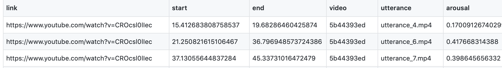
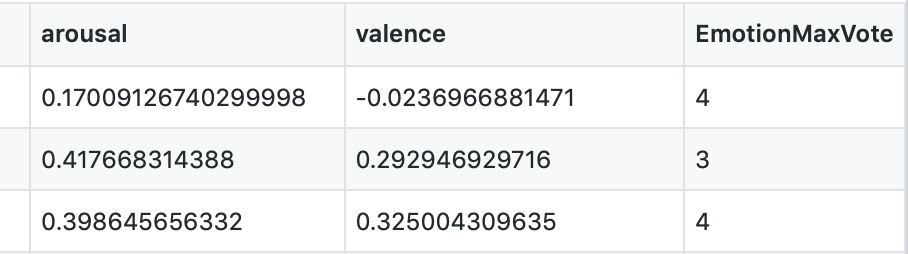
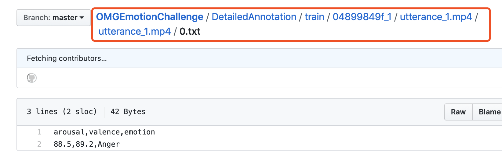
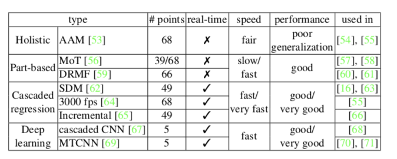
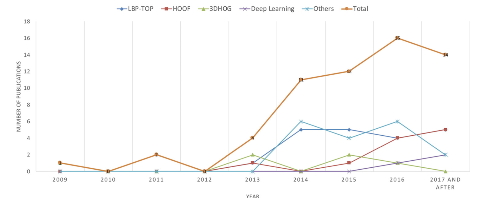
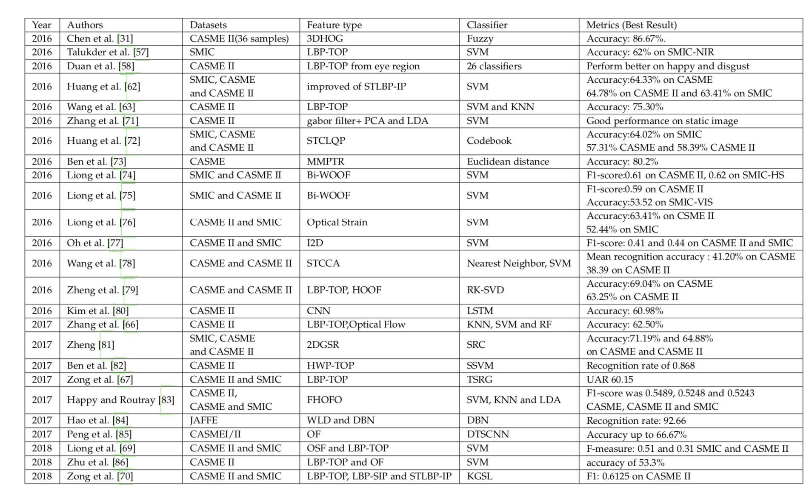

## 网站

### CK+

- 123个subjects
- 593个image sequence，每个image sequence的最后一张frame都有AU的label
- 593个image sequence中有327个sequence有emotion的label

- 每个序列的目标表达式都是完全FACS编码的

- 共有8个label：

  0=neutral, 1=anger, 2=contempt, 3=disgust, 4=fear, 5=happy, 6=sadness, 7=surprise

  

数据集包括四个文件夹

1. the images

   - 序列在峰值帧上编码为FACS
   - 所有的序列都是从从平静到表情表现峰值

2. the landmarks

   所有序列都用AAM跟踪，每个图像有68个地标。

3. The FACS code files

   - 每个序列只有一个FACS文件，即最后一帧(峰值帧)。
   - 文件的每一行对应一个特定的AU，然后是强度。

4. the emotion coded file

   - 593个序列中只有327个序列具有情感序列。

   - 与FACS文件一样，每个序列只有一个情感文件，即最后一帧(峰值帧)

### OMG_Emotion

[数据集链接](https://github.com/knowledgetechnologyuhh/OMGEmotionChallenge)

- 由420个相对较长的情绪视频组成，平均时长为1分钟，收集自Youtube多个频道

- 包括

- 共有7个label

  0 - Anger，1 - Disgust，2 - Fear，3 - Happy，4 - Neutral，5 - Sad，6 - Surprise

数据集包括：

1. omg_TrainVideos.csv

   

   

   - link youtube该视频的链接
   - start 视频的开始时间
   - end 视频的结束时间
   - video video的id，用来连接对应的annotations
   - utterance 名字，用于连接对应的annotations
   - arousal arousal的黄金标准
   - valence valence的黄金标准
   - emotionMaxVote 对所有注释进行投票产生的分类情绪

2. omg_ValidationVideos.csv

   同上

3. DetailedAnnotations 

   标签

   

4. omg_TrainTranscripts.csv

   

   - link youtube视频的链接
   - video video的id，用于和annotations进行连接
   - utterance 名字，用于连接对应的annotations
   - tanscript 每个视频的文字记录

5. omg_TestTranscripts.csv

   同上

   

## 数据集

### 情绪识别

| dataset     | 形式                             | FACS | AU   | subjects（female/male） | 种族差异     | sample                | label | 备注                          |
| ----------- | -------------------------------- | ---- | ---- | ----------------------- | ------------ | --------------------- | ----- | ----------------------------- |
| **CK+**     | image sequences                  | yes  | yes  | 123(18-30yr)            |              | 593（327 with label） | 8     |                               |
| OMG_Emotion | video link                       |      |      | From 567 youtube videos |              | 567                   | 7     | 有音频                        |
| CE          | images                           |      |      | 230（130 /100）         | 大           | 5060                  | 22    |                               |
| DISFA       | stereo video frames              |      |      | 27（12/15）             |              | 130000                |       | 每个图片有66个landmark points |
| **JAFFE**   | images                           |      |      | 60（60/0）              | all Japanese | 213                   | 6     |                               |
| BU-3DFE     | images                           |      |      | 100（56/44）            |              | 2500                  | 6     | 3D human faces                |
| B+          | images                           |      |      | 28                      |              | 16128                 |       | 576 viewing conditions        |
| MMI         | video sequences and still images |      |      | 28（images：75）        |              | 326/2900              | 6     |                               |
| AFEW        | video sequences                  |      |      | 220                     |              | 957                   | 7     | with audio                    |
| Oulu-CASIA  | image sequences                  |      |      | 80                      |              | 2880                  | 6     |                               |

###微表情

| dataset     | FACS | AUS  | Subjects | Samples            | Labels | 种族 |
| ----------- | ---- | ---- | -------- | ------------------ | ------ | ---- |
| Polikovsky  | yes  |      | 11       | 13                 | 7      | 3    |
| USF-HD      | no   | no   |          | 100                | 4      |      |
| YorkDDT     | no   | no   | 9        | 18                 |        |      |
| CASME       | yes  | yes  | 35       | 195                | 7      | 1    |
| **SMIC**    | no   | no   | 20       | 164                | 3      | 3    |
| **CASME2**  | yes  | yes  | 35       | 247                | 5      | 1    |
| SAMM        | yes  | yes  | 32       | 159                | 7      | 13   |
| $CAS(ME)^2$ | no   | yes  | 22       | 53 micro/250 macro | 4      | 1    |

- 查了一些论文使用较多的是SMIC和CASME II
- 在CASME和CASME II中，所有参与者都是中国人，没有种族分布。SMIC有来自3个不同民族的参与者，而SAMM有13个不同民族参与者。
- SAMM在年龄分布上也有优势，平均年龄为33.24岁(SD:±11.32)。
- CASME II和SAMM具有较高的帧速率(200帧每秒)。SAMM是第一个高分辨率的数据集，设置为2040×1088像素，面部面积为400×400。
- CAS(ME)2的微表达样本数量有限，仅收集了53个。
- 在参与者的情绪刺激方面，CASME和SAMM分为7类，CASME II分为5类，SMIC只有3类。
- CASME、CASME II和SAMM都是使用FACS编码的。
- 虽然SAMM是由7个情绪类刺激的，但是在他们第一次发布的微动作的最终标签中只有FACS代码，而没有情绪类。

## 处理方法

### 非深度学习

预处理——特征提取——降维——分类

#### 预处理

1. 灰度归一化

2. pose归一化

3. 尺寸归一化

4. 人脸识别

   去除背景和非人脸区域

   

5. 数据扩充
   1. 实时数据扩充

      从图像的四个角和中心随机裁剪输入样本，然后水平翻转

   2. 离线数据扩充

      随机扰动和变换，如旋转、移位、倾斜、缩放、噪声、对比度和颜色抖动

####特征提取

以前3DHOG比较流行，近年来HOOF和LBP-TOP较流行

#### 降维

LLE、PCA、LDA

### summary

####情绪

| feature + classifier                               | Performance | database               |
| -------------------------------------------------- | ----------- | ---------------------- |
| 3d motion based feature + HMM(Hidden Markov Model) | 81.93       | BU-4DFE                |
| HMM+SVM                                            | 75.62/93.89 | oulu-casia/CK+         |
| LBP+线性programming                                | 93.8        | jaffe                  |
| LBP+AdaBoost                                       | 84.6        | CK+                    |
| PCA+SVM                                            | 87          | mufe                   |
| 手动+CNN                                           | 97.06       | CK+、jaffe、MUG        |
| HOG+SVM                                            | 95          | CK+                    |
| LBP&HOG+softmax                                    | 98.3/90     | CK+/jaffe              |
| LBP+CNN（VGG16）                                   |             | CK+、jaffe、oulu-casia |
| SHIFT+CNN                                          |             | bu-3dfe、multi-PIE     |

### 微表情

| 模型     | performance | dataset   |
| -------- | ----------- | --------- |
| CNN+LSTM | 60.98       | CASME II  |
| DTSCNN   | 66.67       | CASMEI+II |
| 3DCNN    |             |           |

